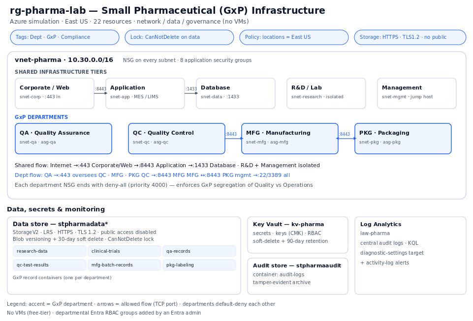
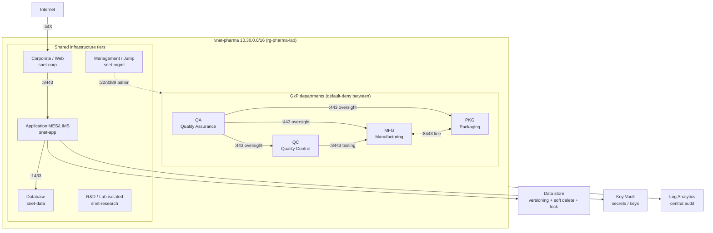

# Azure GxP Pharmaceutical Infrastructure (Hands-On Lab)

A reproducible Azure environment that simulates the core infrastructure of a **small
pharmaceutical company operating under GxP** (Good Manufacturing/Laboratory Practice).
It demonstrates production-style **network segmentation**, **data-integrity controls**,
**secrets management**, and **compliance governance** — deployable from either an Azure CLI
script or a Bicep template, and fully tear-down-able.

> Built and documented as a portfolio project. Everything here costs **$0 / near-zero**
> (no VMs) so it is safe to run in a free or low-budget subscription.



> Tip: add a CI status badge by replacing `<your-username>`:
> ``

---

## Why this design

In a regulated (GxP / 21 CFR Part 11) environment the priorities are **segregation of duties**
and **data integrity**: Quality functions (QA/QC) must be isolated from Operations
(Manufacturing/Packaging) except through defined, auditable paths, and records must be
protected against silent loss or tampering. This lab models exactly that with Azure-native
controls instead of bolt-on tooling.

The four GxP departments are first-class, segmented network zones:

| Dept | Function | Subnet | NSG | ASG |
|------|----------|--------|-----|-----|
| **QA** | Quality Assurance (oversight) | `snet-qa` 10.30.6.0/24 | `nsg-qa` | `asg-qa` |
| **QC** | Quality Control (testing) | `snet-qc` 10.30.7.0/24 | `nsg-qc` | `asg-qc` |
| **MFG** | Manufacturing | `snet-mfg` 10.30.8.0/24 | `nsg-mfg` | `asg-mfg` |
| **PKG** | Packaging | `snet-pkg` 10.30.9.0/24 | `nsg-pkg` | `asg-pkg` |

---

## Architecture (rendered on GitHub)



*Solid arrows are explicitly allowed flows (with TCP port). Every department NSG ends with a
`deny-all` rule at priority 4000, so anything not listed is blocked.*

---

## Repository layout

```
azure-pharma-gxp-lab/
├── README.md
├── LICENSE
├── .gitignore
├── .github/workflows/validate.yml   # CI: validates Bicep + shell scripts on every push
├── infra/
│   ├── main.bicep                   # Infrastructure-as-Code (declarative)
│   └── bastion-gxp-server.bicep     # optional add-on: Azure Bastion + GxP server
├── deploy/
│   ├── deploy.sh                    # Infrastructure-as-Code (Azure CLI, idempotent)
│   └── cleanup.sh                   # safe teardown
└── docs/
    ├── architecture.png             # diagram (README header)
    ├── architecture.svg
    └── AZ-104_Hands-On_Scenario_Lab.docx   # companion study workbook
```

---

## What gets deployed (22 resources, all $0 / near-zero)

**Networking & segmentation** — 1 VNet, 9 subnets (5 shared tiers + 4 GxP departments),
9 NSGs with tiered + departmental rules, 8 ASGs (rules reference app roles, not IPs).

**Data (compliance-hardened)** — `stpharmadata*` (StorageV2, HTTPS-only, TLS 1.2, public
access disabled, **blob versioning + 30-day soft delete**, **CanNotDelete lock**) and
`stpharmaaudit*` (audit-log archive). Per-department record containers: `qa-records`,
`qc-test-results`, `mfg-batch-records`, `pkg-labeling` (+ `research-data`, `clinical-trials`).

**Secrets & monitoring** — Key Vault (RBAC, soft-delete) for secrets/CMK; Log Analytics
workspace as the central audit-log / diagnostics target.

**Governance** — compliance tags, Azure Policy *Allowed locations = East US* (CLI), and a
resource lock on the data store.

---

## Network segmentation rules

| NSG | Rule | Source -> Destination | Port | Action |
|-----|------|----------------------|------|--------|
| nsg-corp | allow-https-in | Internet -> asg-web | 443 | Allow |
| nsg-app | allow-web-to-app | asg-web -> asg-app | 8443 | Allow |
| nsg-data | allow-app-to-sql | asg-app -> asg-db | 1433 | Allow |
| nsg-data | deny-other-to-data | VNet -> asg-db | * | Deny |
| nsg-research | allow-mgmt-only | snet-mgmt -> asg-research | 22/3389 | Allow |
| nsg-qc / mfg / pkg | allow-qa-oversight | asg-qa -> dept | 443 | Allow |
| nsg-mfg | allow-qc-testing | asg-qc -> asg-mfg | 8443 | Allow |
| nsg-mfg / pkg | allow-line-integration | asg-mfg <-> asg-pkg | 8443 | Allow |
| *every dept NSG* | deny-vnet | VNet -> dept | * | Deny (4000) |

---

## Deploy it

Prerequisites: an Azure subscription and the [Azure CLI](https://learn.microsoft.com/cli/azure/install-azure-cli)
(or just open [Azure Cloud Shell](https://shell.azure.com)).

**Option A — Bicep (declarative)**

```bash
az group create -n rg-pharma-lab -l eastus
az deployment group create -g rg-pharma-lab -f infra/main.bicep
```

**Option B — Azure CLI script (adds the data-residency policy too)**

```bash
./deploy/deploy.sh                      # unique resource names auto-generated
LOCATION=westus2 RG=rg-pharma-demo ./deploy/deploy.sh   # override defaults
```

**Tear it down**

```bash
./deploy/cleanup.sh                     # removes the lock, then deletes the resource group
```

---

## CI

`.github/workflows/validate.yml` runs on every push / pull request and:
- syntax-checks and ShellChecks the deployment scripts, and
- runs `az bicep build` to validate the Bicep compiles.

---

## Skills demonstrated (mapped to AZ-104)

- **Virtual networking (15-20%):** VNet/subnet design, NSGs, ASGs, tiered + zero-trust
  segmentation, effective-rule reasoning, data-residency policy.
- **Storage (15-20%):** account hardening, redundancy, versioning, soft delete, container
  design, private-by-default access.
- **Identity & governance (20-25%):** Azure Policy, resource locks, tagging strategy, RBAC model.
- **Monitoring (10-15%):** Log Analytics workspace as a central audit/diagnostics sink.
- **Automation / IaC:** the same environment expressed as **Bicep** *and* an idempotent CLI
  script, validated in **CI**.

A companion **AZ-104 study workbook** (29 scenario-based exercises) is in
`docs/AZ-104_Hands-On_Scenario_Lab.docx`.

---

## Secure remote access (Azure Bastion)

The VNet includes a dedicated `AzureBastionSubnet`, so the lab is ready for **Azure Bastion** —
browser-based RDP/SSH to a VM with **no public IP and no VPN**. The optional module
[`infra/bastion-gxp-server.bicep`](infra/bastion-gxp-server.bicep) deploys Bastion plus a
Windows "GxP server" in the QC subnet (with an NSG rule that lets Bastion reach it). A QC
analyst signs in with Entra ID + MFA and remotes into that server through Bastion from
anywhere — only the screen travels, the regulated data never leaves the VNet, and every
session is logged for the audit trail.

```bash
az deployment group create -g rg-pharma-lab -f infra/bastion-gxp-server.bicep \
  --parameters adminPassword='<Strong-P@ssw0rd-12+chars>'
```

> Azure Bastion (~$140/mo) and the VM incur cost — deploy to demo, then delete when finished.

## Notes & limitations

- **No VMs** are deployed by default (keeps the lab free and quota-independent). The subnets
  model where the LIMS/MES/database/instrument-control servers would live; the optional Bastion
  module above adds a Windows GxP server on demand.
- **Departmental RBAC:** in production, create Microsoft Entra groups (`GxP-QA/QC/MFG/PKG`) and
  grant each one **Storage Blob Data** access scoped to its container. Group creation requires
  an Entra administrator and is therefore left as a documented step.
- **Don't commit secrets.** This repo contains no keys or passwords; keep it that way.

## License

MIT — use freely.
